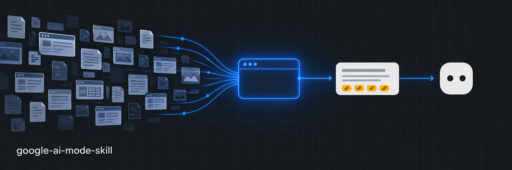

# google-ai-mode-skill

**Research via Google AI — fast, cheap, sourced.**

A drop-in replacement for "deep research" and Perplexity-style loops: instead of your agent fetching thirty pages and reading them all, it asks Google AI Mode, gets a digest of many sources with links, and keeps asking follow-ups in the same thread — from your own Chrome, on your own account.

**Why it's cheaper.** Google already reads and mixes the pages on its side; the agent reads only the digests. What's left for it is the part that needs judgement — pick the angle, challenge a claim, ask what was missed. Fewer tokens, minutes instead of tens of minutes, and a source list you can check.

## Install

```bash
npx skills add mainpart/google-ai-mode-skill -a claude-code -g -y
```

Or clone and run `claude --plugin-dir ./google-ai-mode-skill`.

## Requirements

A browser tool in the session that can open a tab in your logged-in Chrome and run JavaScript in it — four operations: list tabs, open a tab without focusing it, run a script, close the tab. Known mappings (mcp-chrome, chrome-devtools-mcp, Playwright MCP over CDP) are in [`skills/google-ai-mode/references/browser-tools.md`](skills/google-ai-mode/references/browser-tools.md); anything with the same effect works. Google AI Mode has to be available for your account and region.
